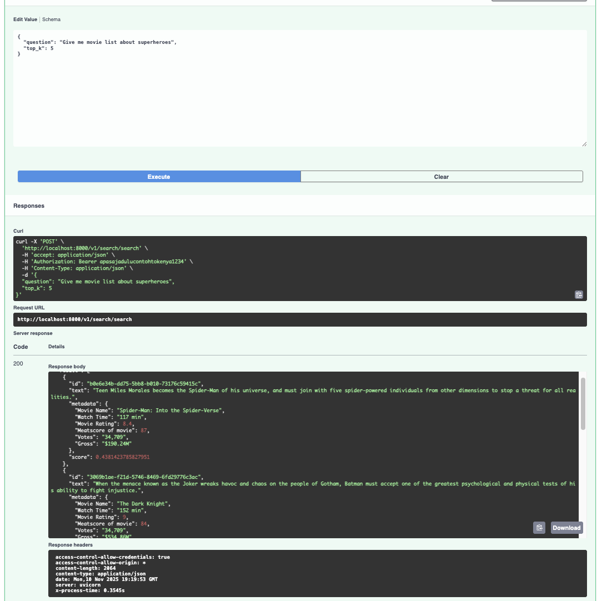

# 🌿 Calyx
## Local Vector Database with Simple Cosine Similarity Search
Calyx is a lightweight local implementation of a vector database using cosine similarity for semantic search.
It’s designed to be simple, self-contained, and easy to run locally without any external services or dependencies.

## 📁 Project Structure
```
.
├── README.md
├── calyx
│   ├── __init__.py
│   ├── api
│   │   └── v1
│   │       ├── auth.py           # Simple authentication route or middleware
│   │       └── search.py         # API endpoint for cosine similarity search
│   ├── config.py                 # App configuration (paths, env vars, etc.)
│   ├── logging.py                # Logging setup
│   ├── main.py                   # API entry point
│   ├── script
│   │   └── init.sh               # Initialization script
│   └── vectordb
│       ├── __init__.py
│       ├── helper.py             # Helper functions for vector math
│       └── vectordb.py           # Core local vector database implementation
├── data
│   ├── movie_description.csv     # Sample dataset
│   └── movie_description.json
├── poetry.lock
├── pyproject.toml
└── search.ipynb                  # Example notebook for vector search
```

## ⚙️ Features
- Local vector storage (CSV/JSON-based)
- Cosine similarity for semantic matching
- RESTful API for search queries
- Lightweight and dependency-free (no external DB)

## 🧩 Installation
1. Clone the Repository
```bash
git clone <this-repo-url>
cd SHOPEE_AI_ENGINEER_CASE_STUDY/calyx/
conda create -n calyx python=3.10 -y
conda activate calyx
```

2. Set Up the Environment
Calyx uses Poetry as its dependency manager.
```
pip install poetry==2.2.1
poetry install
```
3. Environment Variables
Create a .env file in the project root:
```
APP_NAME=calyx
API_KEY=your_api_key
DATA_PATH=./data/movie_description.csv
```
## ▶️ Run the Application
Using Poetry
```
poetry run uvicorn calyx.main:app
```
By default, the API runs on:
http://localhost:8000

## 🔍 API Reference
### POST /api/v1/search
Perform a vector search based on cosine similarity.
Request:
```
curl -X POST http://localhost:8000/api/v1/search \
  -H "Content-Type: application/json" \
  -d '{
    "query": "science fiction movie about space",
    "top_k": 5
  }'
```
Response:
```
{
  "result": [
    {
      "id": "4aed55d7-ab7b-5c03-a39d-6a9b30ad15bc",
      "text": "Luke Skywalker joins forces with a Jedi Knight, a cocky pilot, a Wookiee and two droids to save the galaxy from the Empire's world-destroying battle station, while also attempting to rescue Princess Leia from the mysterious Darth Vader.",
      "metadata": {
        "Movie Name": "Star Wars",
        "Watch Time": "121 min",
        "Movie Rating": 8.6,
        "Meatscore of movie": 90,
        "Votes": "34,709",
        "Gross": "$322.74M"
      },
      "score": 0.3356850053406776
    },
    {
      "id": "90a1b6cc-3eed-513e-837e-5e3cfaf3c14a",
      "text": "After the Rebels are brutally overpowered by the Empire on the ice planet Hoth, Luke Skywalker begins Jedi training with Yoda, while his friends are pursued across the galaxy by Darth Vader and bounty hunter Boba Fett.",
      "metadata": {
        "Movie Name": "Star Wars: Episode V - The Empire Strikes Back",
        "Watch Time": "124 min",
        "Movie Rating": 8.7,
        "Meatscore of movie": 82,
        "Votes": "34,709",
        "Gross": "$290.48M"
      },
      "score": 0.2872858616152044
    },
    {
      "id": "e766938f-d53b-58f1-ab51-fc4a17a6dabe",
      "text": "A team of explorers travel through a wormhole in space in an attempt to ensure humanity's survival.",
      "metadata": {
        "Movie Name": "Interstellar",
        "Watch Time": "169 min",
        "Movie Rating": 8.6,
        "Meatscore of movie": 74,
        "Votes": "34,709",
        "Gross": "$188.02M"
      },
      "score": 0.2500378585148011
    }
  ],
  "latency_ms": 1488
}
```
## 🔗 API Documentation
After running Calyx (usually on port 8000), you can access:
http://localhost:8000/docs
This opens the Swagger UI interface with all API endpoints for testing.

## 🧠 Notebook Example 
The [search.ipynb](calyx/search.ipynb) file demonstrates how to setup and use the vector database directly from a Jupyter notebook for testing, debugging, or experimenting with embedding similarity.